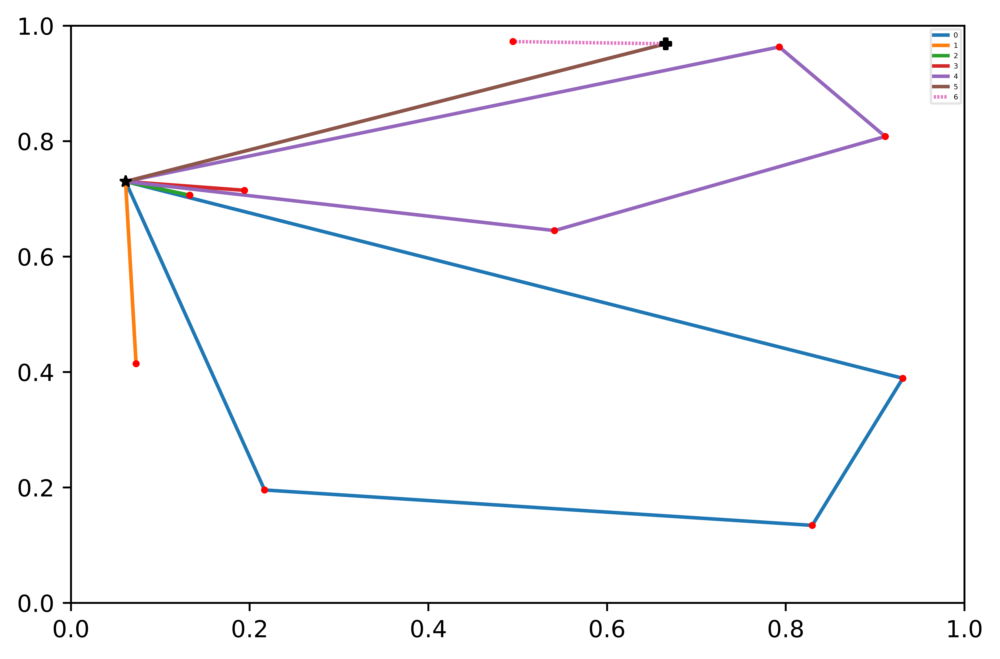
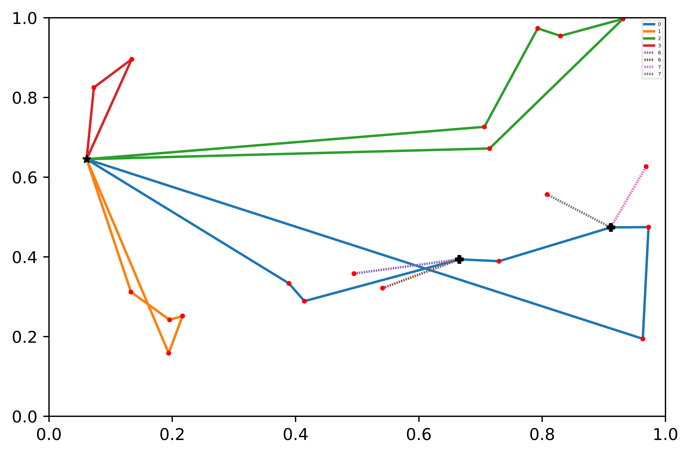

# Deep reinforcement learning for vrp

Implementation of: Nazari, Mohammadreza, et al. "Deep Reinforcement Learning for Solving the Vehicle Routing Problem." arXiv preprint arXiv:1802.04240 (2018).

## Requirements:

* Python 3.6
* pytorch=0.4.1
* matplotlib

## Differences from paper:

* Uses a GRU instead of LSTM for the decoder network
* Critic takes the raw static and dynamic input states and predicts a reward
* Use demand scaling (MAX_DEMAND / MAX_VEHICLE_CAPACITY), and give the depot for the VRP a negative value proportionate to the missing capacity (Unsure if used or not)

## Crowdshipping VRP Sample Tours:

__Left__: VRP with 10 cities + load 20 

__Right__: VRP with 20 cities + load 30

  
  

# VRP

The VRP deals with dynamic elements (load 'L', demand 'D') that change everytime the vehicle / salesman visits a city. Each city is randomly generated with random demand in the range [1, 9]. The salesman has an initial capacity that changes with the complexity of the problem (e.g. number of nodes)

The following __masking scheme__ is used for the VRP:
1. If there is no demand remaining at any city, end the tour. Note this means that the vehicle must return to the depot to complete
2. The vehicle can visit any city, as long as it is able to fully satisfy demand (easy to modify for partial trips if needed)
3. The vehicle may not visit the depot more then once in a row (to speed up training)
4. A vehicle may only visit the depot twice or more in a row if it has completed its route and waiting for other vehicles to finish (e.g. training in a minibatch setting) 

In this project the following dynamic updates are used:
1. If a vehicle visits a city, its load changes according to: Load = Load - Demand_i, and the demand at the city changes according to: Demand_i = (Demand_i - load)+
2. Returning to the vehicle refills the vehicles load. The depot is given a "negative" demand that increases proportional to the amount of load missing from the vehicle
3. If transfer nodes' demands are satisified, the customer nodes which are delivered by crowdworkers and connected to the same transfer node are satisified together.
4. If the customer node are satisified and can be crowdshipping, the demand of the transfer node it connect changes according to the customer node.
# Results:

## Batch size impact

Tour length comparing 128 batch size to the 256 batch size is reported below. The increase in Batch Size also significantly  improves the optimization capability of the model.

|               | Capacity      | Transfers  | Batch Size   | Reward "tour" |
|---------------|---------------|------------|--------------|---------------|
| VRP10         | 20            | 1          | 128          | 5.21          |
| VRP10         | 20            | 1          | 256          | 3.34          |
| VRP20         | 30            | 2          | 128          | 9.26          |
| VRP20         | 30            | 2          | 256          | 6.03          |

## With Crowdshipping

Tour length comparing our research to the Veres(2020) which do not use crowdshipping is reported below. The results with crowdshipping is much better. It also confirmed that  integrating crowdshipping can return a better reward value for the vrp.

|               | Capacity      | Transfers  | Batch Size   | THIS          |Veres(2020)    |DIFF(REWARD)   |
|---------------|---------------|------------|--------------|---------------|---------------|---------------|
| VRP10         | 20            | 1          | 128          | 5.21          | 5.27          | 0.06          |
| VRP10         | 20            | 1          | 256          | 3.34          | 3.42          | 0.08          |
| VRP20         | 30            | 2          | 128          | 9.26          | 9.31          | 0.05          |
| VRP20         | 30            | 2          | 256          | 6.03          | 6.14          | 0.11          |

